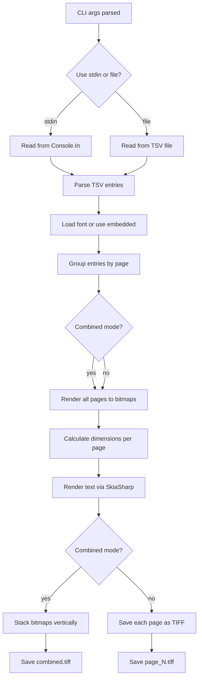

# Goal
Convert TSV files containing bounding box coordinates and text into TIFF images (CCITT G4 compressed, 1-bit). Designed for rendering OCR/layout data back into visual document images.

# Constraints & Preferences
- .NET 8 CLI tool, target `osx-arm64`
- Uses SkiaSharp for rendering, BitMiracle.LibTiff for G4 TIFF output
- Spectre.Console.Cli for CLI argument parsing and progress UI
- Embedded NotoSansCJK font as fallback for CJK text support
- Minimal single-file architecture (all logic in `Program.cs`)

# Progress

## Done
- CLI command with options: `--font`, `--output`, `--scale`, `--crop`, `--combined`, `--stdin`
- TSV parsing: `page\ttext\tx1,y1,x2,y2` format
- Per-page rendering with bounding box-based font sizing
- CCITT G4 1-bit TIFF output
- Combined multi-page TIFF mode
- Stdin input support
- Progress bar via Spectre.Console

## In Progress
- (none)

## Blocked
- (none)

# Key Decisions
- Single-file architecture — project is small enough that splitting adds no value
- Font size derived from bbox height (`bboxHeight * 0.85`)
- 1-bit raster conversion uses simple brightness threshold (`< 0.5`)
- Crop mode shifts to tight bbox with 20px padding; default mode uses absolute coordinates with 50px padding
- TIFF uses `Photometric.MINISWHITE` (white=0, black=1) with MSB2LSB fill order

# Next Steps
- Unknown — no explicit roadmap provided
- Possible improvements: error handling for malformed TSV rows, configurable font size ratio, anti-aliasing toggle for 1-bit output

# Critical Context
- TSV format: `page_number \t text \t x1,y1,x2,y2` (tab-separated, bbox coords comma-separated)
- Text value `\n` is treated as empty/ignored
- Pages are grouped and ordered by page number
- Output defaults to `./output/` directory

# Relevant Files and Their Purposes
- `Program.cs` — All application logic: CLI settings, command execution, TSV parsing, SkiaSharp rendering, TIFF saving
- `Tsv2Tiff.csproj` — Project config: .NET 8, embedded font resource, package references
- `NotoSansCJK-Regular.ttc` — Embedded CJK font (TTC format), used when no `--font` is specified

# System Flow

